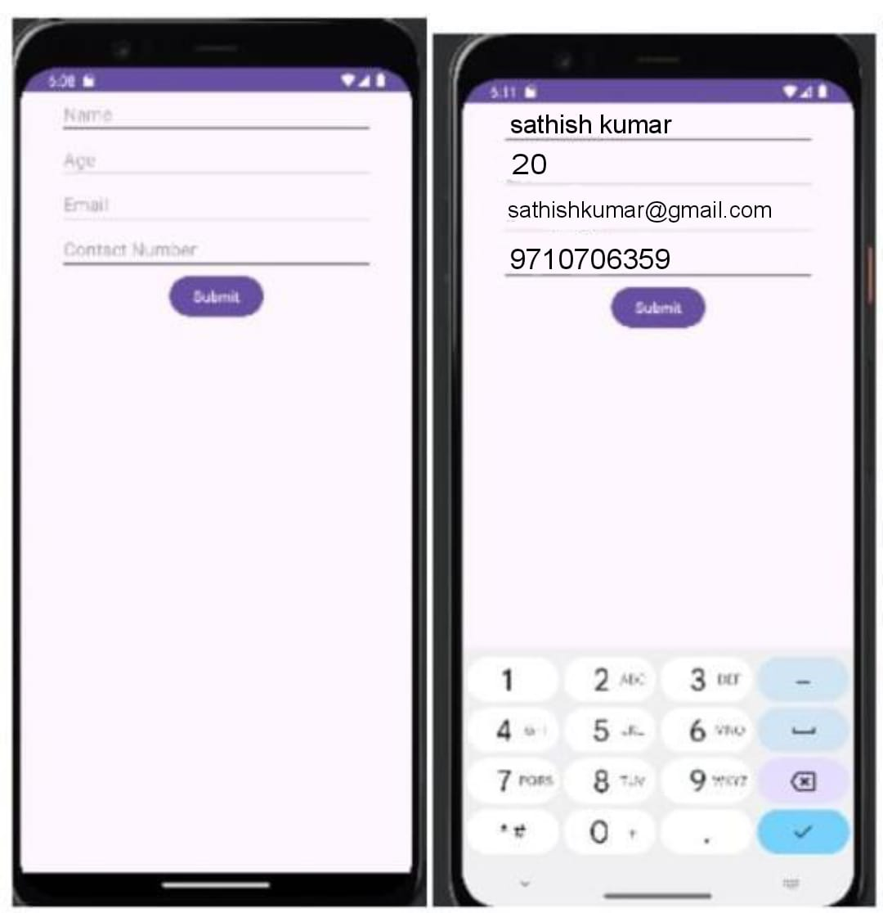

## WORKSHOP: Develop an android application pass the data between the activities using Intent
## AIM:
To create a two screens , first screen will take name, age, contact number and email id from user. After click on submit button, second screen will open and it should display result using Explicit Intents.

## EQUIPMENTS REQUIRED:
Latest Version Android Studio

## ALGORITHM:
Step 1: Open Android Stdio and then click on File -> New -> New project.

Step 2: Then type the Application name as “workshop″ and click Next.

Step 3: Then select the Minimum SDK as shown below and click Next.

Step 4: Then select the Empty Activity and click Next. Finally click Finish.

Step 5: Design layout in activity_main.xml.

Step 6: Get contacts details and Display details give in MainActivity file.

Step 7: Save and run the application.
## PROGRAM:
```
Program to print the text “ExplicitIntent”.
Developed by: SATHISH KUMAR M
Registeration Number : 212222040150
```
## MainActivity.java:
```
package com.example.workshop;
import android.os.Bundle;
import androidx.activity.EdgeToEdge;
import androidx.appcompat.app.AppCompatActivity;
import androidx.core.graphics.Insets;
import androidx.core.view.ViewCompat;
import androidx.core.view.WindowInsetsCompat;

import android.content.Intent;
import android.view.View;
import android.widget.Button;
import android.widget.EditText;

public class MainActivity extends AppCompatActivity {
    EditText editTextName, editTextAge, editTextEmail, editTextContactNumber;
    Button buttonSubmit;

    @Override
    protected void onCreate(Bundle savedInstanceState) {
        super.onCreate(savedInstanceState);
        setContentView(R.layout.activity_main);

        editTextName = findViewById(R.id.editTextName);
        editTextAge = findViewById(R.id.editTextAge);
        editTextEmail = findViewById(R.id.editTextEmail);
        editTextContactNumber = findViewById(R.id.editTextContactNumber);
        buttonSubmit = findViewById(R.id.buttonSubmit);

        buttonSubmit.setOnClickListener(new View.OnClickListener() {
            @Override
            public void onClick(View view) {
                String name = editTextName.getText().toString();
                String age = editTextAge.getText().toString();
                String email = editTextEmail.getText().toString();
                String contactNumber = editTextContactNumber.getText().toString();

                Intent intent = new Intent(MainActivity.this, MainActivity2.class);
                intent.putExtra("name", name);
                intent.putExtra("age", age);
                intent.putExtra("email", email);
                intent.putExtra("contactNumber", contactNumber);
                startActivity(intent);
            }
        });
    }
}
```
## MainActivity2.java:
```
package com.example.workshop;

import android.content.Intent;
import android.os.Bundle;
import android.widget.TextView;
import androidx.appcompat.app.AppCompatActivity;

public class MainActivity2 extends AppCompatActivity {
    TextView textViewName, textViewAge, textViewEmail, textViewContactNumber;

    @Override
    protected void onCreate(Bundle savedInstanceState) {
        super.onCreate(savedInstanceState);
        setContentView(R.layout.activity_second);

        textViewName = findViewById(R.id.textViewName);
        textViewAge = findViewById(R.id.textViewAge);
        textViewEmail = findViewById(R.id.textViewEmail);
        textViewContactNumber = findViewById(R.id.textViewContactNumber);

        Intent intent = getIntent();
        String name = intent.getStringExtra("name");
        String age = intent.getStringExtra("age");
        String email = intent.getStringExtra("email");
        String contactNumber = intent.getStringExtra("contactNumber");

        textViewName.setText("Name: " + name);
        textViewAge.setText("Age: " + age);
        textViewEmail.setText("Email: " + email);
        textViewContactNumber.setText("Contact Number: " + contactNumber);
    }
}
```
## activity_main.xml:
```
<?xml version="1.0" encoding="utf-8"?>
<androidx.constraintlayout.widget.ConstraintLayout xmlns:android="http://schemas.android.com/apk/res/android"
    xmlns:app="http://schemas.android.com/apk/res-auto"
    xmlns:tools="http://schemas.android.com/tools"
    android:layout_width="match_parent"
    android:layout_height="match_parent"
    tools:context=".MainActivity">

    <EditText
        android:id="@+id/editTextName"
        android:layout_width="0dp"
        android:layout_height="wrap_content"
        android:hint="Name"
        app:layout_constraintEnd_toEndOf="parent"
        app:layout_constraintStart_toStartOf="parent"
        app:layout_constraintTop_toTopOf="parent"
        app:layout_constraintWidth_percent="0.8" />

    <EditText
        android:id="@+id/editTextAge"
        android:layout_width="0dp"
        android:layout_height="wrap_content"
        android:hint="Age"
        android:inputType="number"
        app:layout_constraintEnd_toEndOf="parent"
        app:layout_constraintStart_toStartOf="parent"
        app:layout_constraintTop_toBottomOf="@id/editTextName"
        app:layout_constraintWidth_percent="0.8" />

    <EditText
        android:id="@+id/editTextEmail"
        android:layout_width="0dp"
        android:layout_height="wrap_content"
        android:hint="Email"
        android:inputType="textEmailAddress"
        app:layout_constraintEnd_toEndOf="parent"
        app:layout_constraintStart_toStartOf="parent"
        app:layout_constraintTop_toBottomOf="@id/editTextAge"
        app:layout_constraintWidth_percent="0.8" />

    <EditText
        android:id="@+id/editTextContactNumber"
        android:layout_width="0dp"
        android:layout_height="wrap_content"
        android:hint="Contact Number"
        android:inputType="phone"
        app:layout_constraintEnd_toEndOf="parent"
        app:layout_constraintStart_toStartOf="parent"
        app:layout_constraintTop_toBottomOf="@id/editTextEmail"
        app:layout_constraintWidth_percent="0.8" />

    <Button
        android:id="@+id/buttonSubmit"
        android:layout_width="wrap_content"
        android:layout_height="wrap_content"
        android:text="Submit"
        app:layout_constraintEnd_toEndOf="parent"
        app:layout_constraintStart_toStartOf="parent"
        app:layout_constraintTop_toBottomOf="@id/editTextContactNumber" />

</androidx.constraintlayout.widget.ConstraintLayout>
```
## activity_second.xml:
```
<?xml version="1.0" encoding="utf-8"?>
<androidx.constraintlayout.widget.ConstraintLayout xmlns:android="http://schemas.android.com/apk/res/android"
    xmlns:app="http://schemas.android.com/apk/res-auto"
    xmlns:tools="http://schemas.android.com/tools"
    android:layout_width="match_parent"
    android:layout_height="match_parent"
    tools:context=".MainActivity2">

    <TextView
        android:id="@+id/textViewName"
        android:layout_width="0dp"
        android:layout_height="wrap_content"
        android:text="Name: "
        app:layout_constraintEnd_toEndOf="parent"
        app:layout_constraintStart_toStartOf="parent"
        app:layout_constraintTop_toTopOf="parent"
        app:layout_constraintWidth_percent="0.8" />

    <TextView
        android:id="@+id/textViewAge"
        android:layout_width="0dp"
        android:layout_height="wrap_content"
        android:text="Age: "
        app:layout_constraintEnd_toEndOf="parent"
        app:layout_constraintStart_toStartOf="parent"
        app:layout_constraintTop_toBottomOf="@id/textViewName"
        app:layout_constraintWidth_percent="0.8" />

    <TextView
        android:id="@+id/textViewEmail"
        android:layout_width="0dp"
        android:layout_height="wrap_content"
        android:text="Email: "
        app:layout_constraintEnd_toEndOf="parent"
        app:layout_constraintStart_toStartOf="parent"
        app:layout_constraintTop_toBottomOf="@id/textViewAge"
        app:layout_constraintWidth_percent="0.8" />

    <TextView
        android:id="@+id/textViewContactNumber"
        android:layout_width="0dp"
        android:layout_height="wrap_content"
        android:text="Contact Number: "
        app:layout_constraintEnd_toEndOf="parent"
        app:layout_constraintStart_toStartOf="parent"
        app:layout_constraintTop_toBottomOf="@id/textViewEmail"
        app:layout_constraintWidth_percent="0.8" />
</androidx.constraintlayout.widget.ConstraintLayout>
```
### AndroidManifest.xml:
```
<?xml version="1.0" encoding="utf-8"?>
<manifest xmlns:android="http://schemas.android.com/apk/res/android"
    xmlns:tools="http://schemas.android.com/tools">

    <application
        android:allowBackup="true"
        android:dataExtractionRules="@xml/data_extraction_rules"
        android:fullBackupContent="@xml/backup_rules"
        android:icon="@mipmap/ic_launcher"
        android:label="@string/app_name"
        android:roundIcon="@mipmap/ic_launcher_round"
        android:supportsRtl="true"
        android:theme="@style/Theme.Workshop"
        tools:targetApi="31">
        <activity
            android:name=".MainActivity"
            android:exported="true">
            <intent-filter>
                <action android:name="android.intent.action.MAIN" />

                <category android:name="android.intent.category.LAUNCHER" />
            </intent-filter>
        </activity>
        <activity android:name=".MainActivity2" />
    </application>

</manifest>
```
## OUTPUT:




## RESULT:
Thus a Android Application create a Explicit Intents using Android Studio is developed and executed successfully.
